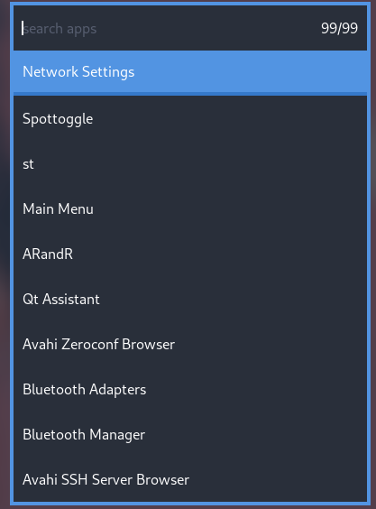

# golaunch
a simple .desktop file launcher

install with: `go get github.com/hen6003/golaunch`

can be used with any other application like fzf which gives the user a choice from a list and, returns what the user chooses
with this:
  `golaunch | fzf | golaunch`

so with instantmenu from instantos:
  `golaunch | instantmenu -i -f -q "search apps" -l 10 -c -w -1 -h -1 -bw 4 | golaunch`

you can choose what terminal launches terminal apps with an arg:
  `golaunch | fzf | golaunch st`

